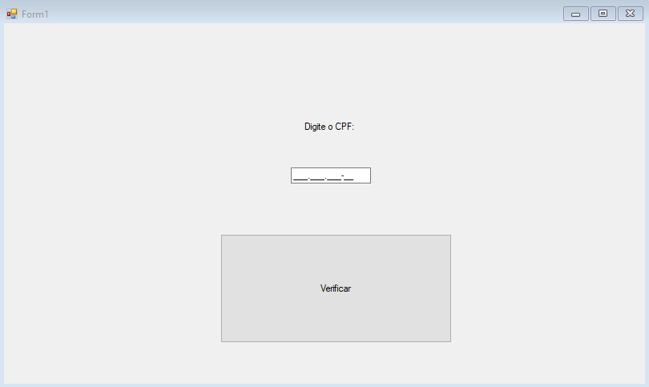
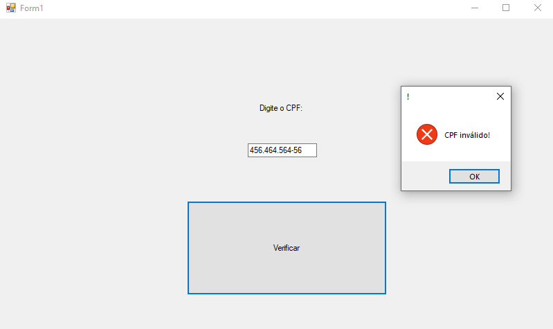
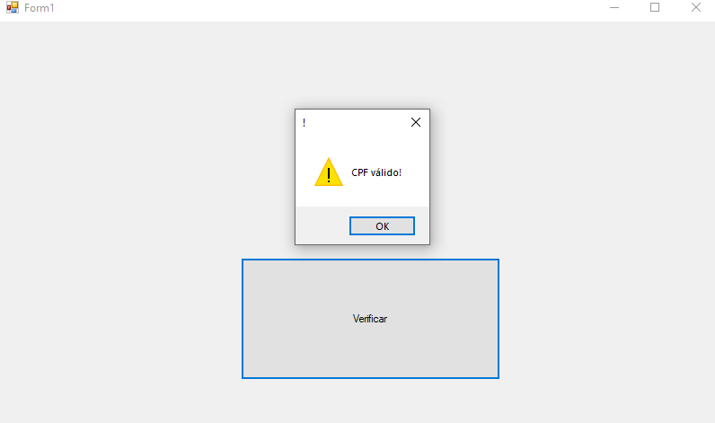

# validacaoCPF-CSharp
programa no c sharp com classe para validar CPF. Segundo semestre na ETEC de guarulhos
 

  <h3>Menu para validar CPF</h3>
  

  

  <h3>Um cpf aleatório inválido e o meu CPF válido (e escondido)</h3>
  

